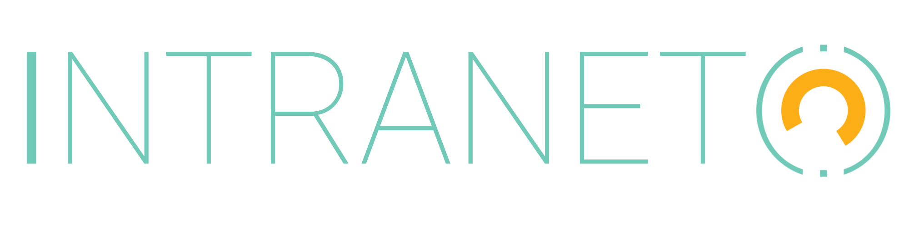
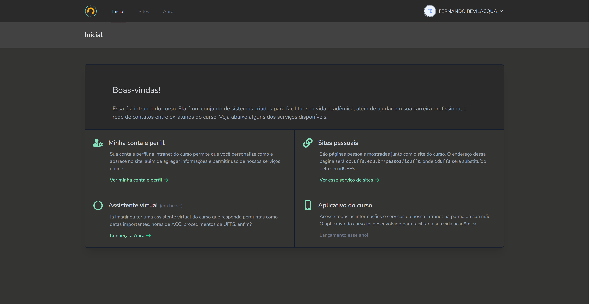

<p align="center">
    <br />
    
    
</p>

# Intranet

A intranet é um sistema cujo principal objetivo é prover serviços digitais para a comunidade do curso de [Ciência da Computação](https://cc.uffs.edu.br) da [Universidade Federal da Fronteira Sul (UFFS)](https://www.uffs.edu.br). Entre os serviços estão páginas pessoais, assistente virtual e agregação de informações.

> **IMPORTANTE:** o serviço está em funcionamento em: [cc.uffs.edu.br/intranet](https://cc.uffs.edu.br/intranet).

## ✨ Features

A intranet possui um conjunto modesto de features:

-   Autenticação a partir do idUFFS;
-   Controle de páginas pessoais (tipo Github Pages);
-   Acesso à assistente virtual do curso;
-   Informações de perfil;



## 🚀 Começando

### 1. Dependências

Para executar o projeto, você precisa ter o seguinte instalado (preceisa `php >= 8.0`).:

-   [Git](https://git-scm.com);
-   [PHP 8.x](https://www.php.net/downloads);
-   [Composer](https://getcomposer.org/download/);
-   [NodeJS](https://nodejs.org/en/);
-   [NPM](https://www.npmjs.com/package/npm);

> _IMPORTANTE:_ se sua distribuição linux não tem PHP 8.x disponível, rode `sudo add-apt-repository ppa:ondrej/php` antes de começar.

Você precisa de várias extensões PHP instaladas também:

```
sudo apt-get update
sudo apt install php8.0-cli php8.0-mbstring php8.0-zip php8.0-xml php8.0-curl php8.0-sqlite3 php8.0-curl
```

### 2. Configuração

Feito a instalação das dependências, é necessário obter uma cópia do projeto. A forma recomendada é clonar o repositório para a sua máquina.

Para isso, rode:

```
git clone --recurse-submodules https://github.com/ccuffs/intranet && cd intranet
```

Isso criará e trocará para a pasta `intranet` com o código do projeto.

#### 2.1 PHP

Instale as dependências do PHP usando o comando abaixo:

```
composer install
```

#### 2.2 Banco de Dados

O banco de dados mais simples para uso é o SQLite. Para criar uma base usando esse SGBD, rode:

```
touch database/database.sqlite
```

#### 2.3 Node

Instale também as dependências do NodeJS executando:

```
npm install
```

#### 2.4 Laravel

Crie o arquivo `.env` a partir do arquivo `.env.example` gerado automaticamente pelo Laravel:

```
cp .env.example .env
```

Criação as tabelas do banco de dados com as migrações esquemas:

```
php artisan migrate
```

Rode os seeders (que crias as categorias/serviços padrão):

```
php artisan db:seed
```

Gere os recursos JavaScript e CSS:

```
npm run dev
```

> _DICA:_ enquanto estiver desenvolvendo, rode `npm run watch` para manter os scripts javascript sendo gerados sob demanda quando alterados.

Por fim, garanta que o storage do Laravel está disponível para acesso web:

```
php artisan storage:link
```

### 3. Utilizacão

#### 3.1 Rodando o projeto

Depois de seguir todos os passos de instalação, inicie o servidor do Laravel:

```
php artisan serve
```

Após isso a aplicação estará rodando na porta `8000` e poderá ser acessada em [localhost:8000](http://localhost:8000).

## 🤝 Contribua

Sua ajuda é muito bem-vinda, independente da forma! Confira o arquivo [CONTRIBUTING.md](CONTRIBUTING.md) para conhecer todas as formas de contribuir com o projeto. Por exemplo, [sugerir uma nova funcionalidade](https://github.com/ccuffs/intranet/issues/new?assignees=&labels=&template=feature_request.md&title=), [reportar um problema/bug](https://github.com/ccuffs/intranet/issues/new?assignees=&labels=bug&template=bug_report.md&title=), [enviar um pull request](https://github.com/ccuffs/hacktoberfest/blob/master/docs/tutorial-pull-request.md), ou simplemente utilizar o projeto e comentar sua experiência.

Veja o arquivo [ROADMAP.md](ROADMAP.md) para ter uma ideia de como o projeto deve evoluir.

## 🎫 Licença

Esse projeto é licenciado nos termos da licença open-source [MIT](https://choosealicense.com/licenses/mit) e está disponível de graça.

## 🧬 Changelog

Veja todas as alterações desse projeto no arquivo [CHANGELOG.md](CHANGELOG.md).

## 🧪 Links úteis

Abaixo está uma lista de links interessantes e projetos similares:

-   [Universidade Federal da Fronteira Sul](https://www.uffs.edu.br)
-   [API CC](https://github.com/ccuffs/api-cc)
-   [Auth idUFFS](https://github.com/ccuffs/auth-iduffs)
